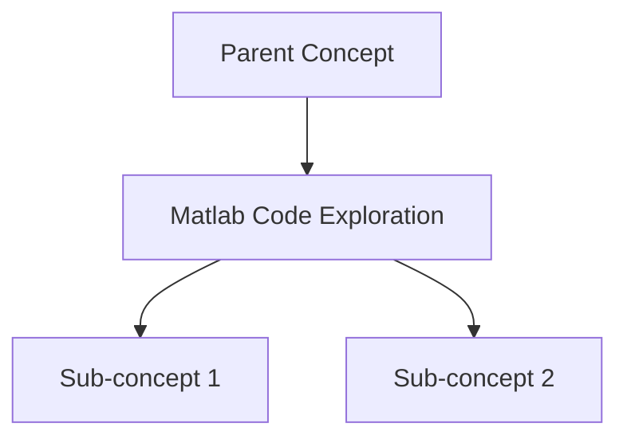

# 📘 Matlab Code Exploration

> **Category:** Implementation
> **Difficulty:** Research-Level
> **Status:** 🟡 In Progress
> **Priority:** 🔴 Critical

---

## 🎯 Learning Objectives
By understanding this concept, I should be able to:
- [ ] Explain the purpose and behavior of the code to someone unfamiliar with the project
- [ ] Interpret the visual representations the code produces
- [ ] Confidently edit the code
- [ ] Describe the code in pseudo-code

---

## 📖 Definition
> **Matlab Code Exploration:**
>**Meta** - 
>The code is contained inside of 2 folders(fig2, fig5).
>It is made up of 6 files(fig2: [fig2a](Resources/Fig2/Fig2a.m), [fig2b](resources/fig2/fig2b.m), [fig2c](resources/fig2/fig2c.m) | fig5: [fig5a](resources/fig5/fig5b), [fig5b](resources/fig5/fig5b), [fig5c](resources/fig5/fig5c))

The files implement tracking control neural networks for [[give me a comprehensive report on affine discrete-.pdf|Affine Discrete Time Nonlinear Systems]]
#### Fig2
Implements a simulation of a [[continuous stirred tank reactor.pdf|Continuous Stirred Tank Reactor]] cooling control problem
#### Fig5
Implements a simulation of a mechanical/motion? control system(clarification needed)

---

## 🧠 Intuitive Explanation
*Explain in simple terms, as if to someone unfamiliar:*


---

## 📐 Mathematical Formulation

### Key Equations
$$

$$

### Notation
| Symbol | Meaning |
|--------|---------|
| | |

---

## 🔗 Prerequisites
*Concepts I need to understand first:*
- [[]]
- [[]]

---

## 🌳 Concept Hierarchy



---

## 💡 Key Insights
1. 
2. 
3. 

---

## 🔬 Connection to Project

### Where This Appears
- In the paper: 
- In the project:

### Why It Matters
- 

### How I'll Use It
- 

---

## 📊 Examples

### Example 1: Basic
**Problem:**

**Solution:**

### Example 2: Applied to Project
**Context:**

**Application:**

---

## ⚠️ Common Misconceptions
1. ❌ **Misconception:**
   ✅ **Reality:**

2. ❌ **Misconception:**
   ✅ **Reality:**

---

## 🔄 Related Concepts
```dataview
TABLE status, priority
FROM #concept
WHERE category = "Implementation" AND file.name != this.file.name
SORT priority ASC
```

---

## ❓ Questions

### Resolved
- [x] Q: 
  - A: 

### Unresolved (Ask Professor)
- [ ] Q: 

---

## 📚 Resources

### Primary Sources
- 

### Supplementary
- 

### Videos/Tutorials
- 

---

## ✍️ My Notes & Working

### Derivations


### Proofs I've Worked Through


---

## 🧪 Self-Test Questions
1. **Q:** 
   - **A:** %%collapsed answer%%

2. **Q:** 
   - **A:** %%collapsed answer%%

---

## 📅 Learning Progress

| Date | Activity | Notes |
|------|----------|-------|
| 2025-12-27 | Created note | |
| | | |

---

## 🏷️ Connections
*Link to other notes where this concept appears:*
- [[]]
