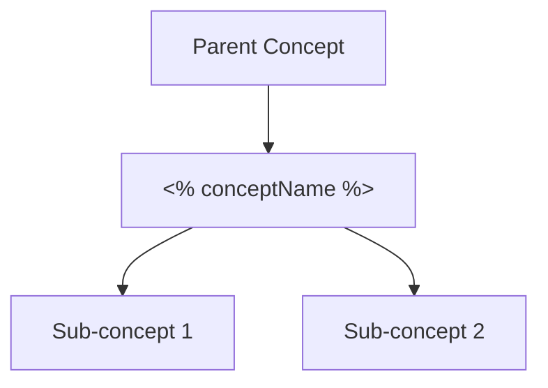

<%*
// Concept Note Template
// For learning and documenting individual concepts
const conceptName = await tp.system.prompt("Concept name:");

// Concept category
const categoryOptions = [
    "Mathematical Foundation",
    "Control Theory",
    "Stability Analysis",
    "Neural Networks",
    "Adversarial Attacks",
    "Defense Mechanisms",
    "Implementation",
    "Optimization",
    "Linear Algebra",
    "Difference Equations"
];
const category = await tp.system.suggester(categoryOptions, categoryOptions, false, "Category:");

// Difficulty level
const difficultyOptions = ["Foundational", "Intermediate", "Advanced", "Research-Level"];
const difficulty = await tp.system.suggester(difficultyOptions, difficultyOptions, false, "Difficulty level:");

// Understanding status
const statusOptions = ["🔴 Not Started", "🟡 In Progress", "🟢 Understood", "⭐ Mastered"];
const status = await tp.system.suggester(statusOptions, statusOptions, false, "Current understanding:");

// Priority for project
const priorityOptions = ["🔴 Critical", "🟡 Important", "🟢 Helpful", "⚪ Optional"];
const priority = await tp.system.suggester(priorityOptions, priorityOptions, false, "Priority for project:");
_%>
---
concept: "<% conceptName %>"
category: <% category %>
difficulty: <% difficulty %>
status: <% status %>
priority: <% priority %>
date_created: <% tp.date.now("YYYY-MM-DD") %>
date_updated: <% tp.date.now("YYYY-MM-DD") %>
type: concept
tags: [concept, <% category.toLowerCase().replace(/ /g, '-') %>, learning]
---

# 📘 <% conceptName %>

> **Category:** <% category %>
> **Difficulty:** <% difficulty %>
> **Status:** <% status %>
> **Priority:** <% priority %>

---

## 🎯 Learning Objectives
By understanding this concept, I should be able to:
- [ ] 
- [ ] 
- [ ] 

---

## 📖 Definition
> **<% conceptName %>:**
> 

---

## 🧠 Intuitive Explanation
*Explain in simple terms, as if to someone unfamiliar:*


---

## 📐 Mathematical Formulation

### Key Equations
$$

$$

### Notation
| Symbol | Meaning |
|--------|---------|
| | |

---

## 🔗 Prerequisites
*Concepts I need to understand first:*
- [[]]
- [[]]

---

## 🌳 Concept Hierarchy



---

## 💡 Key Insights
1. 
2. 
3. 

---

## 🔬 Connection to Project

### Where This Appears
- In the paper: 
- In the project:

### Why It Matters
- 

### How I'll Use It
- 

---

## 📊 Examples

### Example 1: Basic
**Problem:**

**Solution:**

### Example 2: Applied to Project
**Context:**

**Application:**

---

## ⚠️ Common Misconceptions
1. ❌ **Misconception:**
   ✅ **Reality:**

2. ❌ **Misconception:**
   ✅ **Reality:**

---

## 🔄 Related Concepts
```dataview
TABLE status, priority
FROM #concept
WHERE category = "<% category %>" AND file.name != this.file.name
SORT priority ASC
```

---

## ❓ Questions

### Resolved
- [x] Q: 
  - A: 

### Unresolved (Ask Professor)
- [ ] Q: 

---

## 📚 Resources

### Primary Sources
- 

### Supplementary
- 

### Videos/Tutorials
- 

---

## ✍️ My Notes & Working

### Derivations


### Proofs I've Worked Through


---

## 🧪 Self-Test Questions
1. **Q:** 
   - **A:** %%collapsed answer%%

2. **Q:** 
   - **A:** %%collapsed answer%%

---

## 📅 Learning Progress

| Date | Activity | Notes |
|------|----------|-------|
| <% tp.date.now("YYYY-MM-DD") %> | Created note | |
| | | |

---

## 🏷️ Connections
*Link to other notes where this concept appears:*
- [[]]
