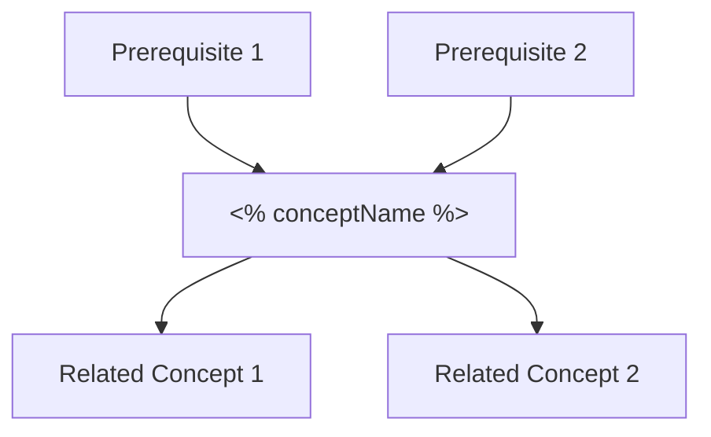

<%*
// ═══════════════════════════════════════════════════════════════════════════
// FIRST PRINCIPLES LEARNING TEMPLATE
// Research Project: Defending Tracking Control NN Against Adversarial Attacks
// Mentor: Dr. Pavlo Tymoshchuk (UNT) | Duration: Jan 26 - Apr 10, 2026
// ═══════════════════════════════════════════════════════════════════════════

// Prompt for concept details
const conceptName = await tp.system.prompt("Concept Name:");
const category = await tp.system.suggester(
    [
        "1. Mathematical Foundations",
        "2. Control Theory Fundamentals", 
        "3. Stability Analysis",
        "4. Neural Network Concepts",
        "5. Adversarial Attacks & Defense",
        "6. Implementation Skills",
        "7. Project Timeline & Deliverables"
    ],
    [
        "mathematical-foundations",
        "control-theory",
        "stability-analysis",
        "neural-networks",
        "adversarial-defense",
        "implementation",
        "project-tasks"
    ],
    false,
    "Select Category:"
);

const subcategory = await tp.system.prompt("Subcategory (e.g., 1.1 Difference Equations):");

const priority = await tp.system.suggester(
    ["🔴 Critical - Must understand deeply", "🟡 Important - Should understand well", "🟢 Helpful - Good to know"],
    ["critical", "important", "helpful"],
    false,
    "Priority Level:"
);

const learningMethod = await tp.system.suggester(
    ["📖 Self-Study", "👨‍🏫 Ask Professor", "🔬 Both - Study then Discuss"],
    ["self-study", "ask-professor", "both"],
    false,
    "Learning Method:"
);

const relatedMilestone = await tp.system.suggester(
    [
        "Week 1 (Jan 26-Feb 2): Difference Equation Description",
        "Week 2 (Feb 2-9): Existence & Uniqueness Analysis",
        "Week 3 (Feb 9-16): Stability & Convergence",
        "Weeks 4-5 (Feb 16-Mar 2): Block Diagram Analysis",
        "Week 6 (Mar 2-9): Implementation",
        "Weeks 7-9: Comparison & Simulation",
        "Not milestone-specific"
    ],
    ["week1", "week2", "week3", "week4-5", "week6", "week7-9", "none"],
    false,
    "Related Project Milestone:"
);

// Set filename
const filename = conceptName.replace(/[^a-zA-Z0-9\s]/g, '').replace(/\s+/g, '_');
await tp.file.rename(filename);
-%>
---
aliases: [<% conceptName %>]
tags:
  - first-principles
  - research-project
  - <% category %>
  - <% priority %>
created: <% tp.date.now("YYYY-MM-DD HH:mm") %>
updated: <% tp.date.now("YYYY-MM-DD HH:mm") %>
category: "<% category %>"
subcategory: "<% subcategory %>"
priority: "<% priority %>"
learning_method: "<% learningMethod %>"
milestone: "<% relatedMilestone %>"
understanding_level: "0/5"
status: "not-started"
---

# <% conceptName %>

> [!info] Metadata
> **Category:** <% subcategory %>
> **Priority:** <% priority === "critical" ? "🔴 Critical" : priority === "important" ? "🟡 Important" : "🟢 Helpful" %>
> **Learning Method:** <% learningMethod === "self-study" ? "📖 Self-Study" : learningMethod === "ask-professor" ? "👨‍🏫 Ask Professor" : "🔬 Both" %>
> **Related Milestone:** <% relatedMilestone %>
> **Understanding Level:** ⬜⬜⬜⬜⬜ (0/5)

---

## 🎯 Why This Matters (First Principles Connection)

> [!question] Core Question
> Why do I need to understand this concept for my research project?

**Connection to Research Goal:**
<!-- How does this concept connect to "Defending Tracking Control NN Against Adversarial Attacks"? -->


**Prerequisite For:**
<!-- What other concepts build on this? -->
- 

**Builds Upon:**
<!-- What concepts should I understand first? -->
- 

---

## 📐 Formal Definition

> [!abstract] Definition
> <!-- Precise mathematical or technical definition -->


### Mathematical Formulation

$$

$$

### Key Variables & Notation

| Symbol | Meaning | Domain/Range |
|--------|---------|--------------|
|        |         |              |
|        |         |              |

---

## 💡 Intuitive Understanding

> [!tip] In Plain Words
> <!-- Explain like I'm teaching someone else - no jargon -->


### Analogy/Metaphor

<!-- Real-world analogy that captures the essence -->


### Visual Representation

```
<!-- ASCII diagram, or link to image/drawing -->

```

### Why It Works (Mechanism)

<!-- The underlying reason/mechanism - not just "what" but "why" -->


---

## 🔗 Connection to Project Equations

### From Paper Reference [1] - Tymoshchuk 2024

<!-- How does this concept appear in the key equations? -->

**System Equation:**
$$x(k+1) = x(k) + \tau(f(x(k)) + g(x(k))u(k))$$

**Tracking Equation:**
$$x(k+1) = x(k) - \beta \text{sgn}(x(k)-r(k)) + \Delta r(k)$$

**Control Equation:**
$$u(k) = g^{-1}(x(k))(-\beta \text{sgn}(x(k)-r(k)) + \Delta r(k) - f(x(k)))$$

**This concept relates to:**
<!-- Which equation(s) and how? -->


---

## 📚 Verified Sources

> [!warning] Source Verification Required
> All claims must be traceable to authoritative sources

### Primary Sources (Peer-Reviewed)

1. **Source:**
   - **Claim:** 
   - **Page/Section:** 
   - **Verification Status:** ⬜ Verified / ⬜ Pending

2. **Source:**
   - **Claim:** 
   - **Page/Section:** 
   - **Verification Status:** ⬜ Verified / ⬜ Pending

### Textbook References

| Textbook | Chapter/Section | Topics Covered |
|----------|-----------------|----------------|
| Khalil - Nonlinear Systems | | |
| Ogata - Discrete-Time Control | | |
| Lewis - Optimal Control | | |
| Haykin - Neural Networks | | |

### Online Resources

- [ ] MIT OCW: 
- [ ] YouTube (3Blue1Brown, etc.): 
- [ ] Documentation: 

---

## ❓ Questions & Clarifications

### Questions for Self-Study

1. 
2. 
3. 

### Questions for Professor

> [!question] Priority Questions for Dr. Tymoshchuk
> <!-- Questions that require expert guidance -->

1. **Question:** 
   - **Why ask professor:** 
   - **Status:** ⬜ Asked / ⬜ Answered
   - **Answer:** 

2. **Question:** 
   - **Why ask professor:** 
   - **Status:** ⬜ Asked / ⬜ Answered
   - **Answer:** 

---

## 🧪 Worked Examples

### Example 1: Basic Application

**Problem:**


**Solution:**


**Key Insight:**


### Example 2: Project-Relevant Application

**Context:** (How this applies to tracking control NN)


**Setup:**


**Analysis:**


**Conclusion:**


---

## ⚠️ Common Misconceptions & Pitfalls

> [!danger] Watch Out For

1. **Misconception:** 
   - **Reality:** 

2. **Pitfall:** 
   - **How to Avoid:** 

---

## 🔄 Connections to Other Concepts



### Concept Map

| Related Concept | Relationship | Link |
|-----------------|--------------|------|
|                 | builds on    | [[]] |
|                 | required for | [[]] |
|                 | contrasts with | [[]] |

---

## 💻 Implementation Notes

### MATLAB/Simulink

```matlab
% Key implementation snippet

```

### Python

```python
# Key implementation snippet

```

### C++/CUDA

```cpp
// Key implementation snippet

```

---

## 📊 Progress Tracking

### Understanding Checkpoints

- [ ] Can state the formal definition from memory
- [ ] Can explain intuitively to a peer
- [ ] Can derive/prove key results
- [ ] Can apply to worked examples
- [ ] Can connect to research project equations
- [ ] Can implement in code

### Session Log

| Date | Duration | Focus Area | Progress Notes |
|------|----------|------------|----------------|
| <% tp.date.now("YYYY-MM-DD") %> | | Initial creation | |
| | | | |

---

## 🎓 Summary for Quick Review

> [!summary] Key Takeaways
> 1. 
> 2. 
> 3. 

### One-Sentence Summary

<!-- If I had to explain this in one sentence: -->


### Flashcard-Style Q&A

**Q:** What is <% conceptName %>?
**A:** 

**Q:** Why is it important for the research project?
**A:** 

**Q:** Key equation/formula?
**A:** 

---

## 📎 Attachments & Related Files

- [[]] - Related note
- [[]] - Proof/derivation
- [[]] - Implementation code

---

*Last reviewed: <% tp.date.now("YYYY-MM-DD") %>*
*Next review: <% tp.date.now("YYYY-MM-DD", 7) %>*
