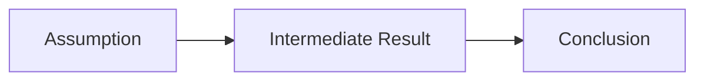

<%*
// Proof/Derivation Note Template
// For documenting mathematical proofs and derivations
const proofName = await tp.system.prompt("Proof/Derivation name:");

const typeOptions = ["Existence Proof", "Uniqueness Proof", "Stability Proof", "Convergence Proof", "Derivation", "Lemma", "Theorem", "Corollary"];
const proofType = await tp.system.suggester(typeOptions, typeOptions, false, "Type:");

const statusOptions = ["🔴 Not Started", "🟡 Working Through", "🟢 Understood", "✅ Can Reproduce", "⭐ Can Extend"];
const status = await tp.system.suggester(statusOptions, statusOptions, false, "Understanding status:");

const sourceOptions = ["Tymoshchuk 2024 (Neural Computing)", "Tymoshchuk 2024 (Book Chapter)", "Jedh 2023 (ACC Security)", "Khalil - Nonlinear Systems", "Own Derivation", "Other"];
const source = await tp.system.suggester(sourceOptions, sourceOptions, false, "Source:");
_%>
---
proof: "<% proofName %>"
type: <% proofType %>
status: <% status %>
source: "<% source %>"
date_created: <% tp.date.now("YYYY-MM-DD") %>
date_updated: <% tp.date.now("YYYY-MM-DD") %>
note_type: proof
tags: [proof, mathematics, <% proofType.toLowerCase().replace(/ /g, '-') %>]
---

# 📐 <% proofName %>

> **Type:** <% proofType %>
> **Status:** <% status %>
> **Source:** <% source %>

---

## 📋 Statement

### Theorem/Lemma Statement
> **<% proofType %>:** 
> 

### In Plain English
*What does this say intuitively?*


---

## 🎯 Why This Matters

### For the Project
- 

### In the Broader Theory
- 

---

## 📝 Prerequisites

### Definitions Needed
1. **Definition (<name>):**
   
2. **Definition (<name>):**

### Prior Results Used
- [[]] (Lemma/Theorem)
- [[]]

### Assumptions
1. 
2. 

---

## 🔬 Proof Structure

### Proof Strategy
*High-level approach:*


### Proof Outline
```
1. Start with: 
2. Apply: 
3. Show that: 
4. Conclude: 
```

---

## 📐 Detailed Proof

### Step 1: Setup
*Starting point and definitions:*

$$

$$

---

### Step 2: 
*Description of this step:*

$$

$$

**Justification:** 

---

### Step 3:
*Description:*

$$

$$

**Justification:** 

---

### Step 4:
*Description:*

$$

$$

**Justification:** 

---

### Conclusion
*Final step and what we've shown:*

$$

$$

$\blacksquare$

---

## 🧠 Key Insights

### Critical Steps
- **Step ___ is crucial because:** 

### Where the Assumptions Are Used
- Assumption 1 is used in Step ___ to:
- Assumption 2 is used in Step ___ to:

### What Could Go Wrong Without Assumptions
- Without assumption 1: 
- Without assumption 2: 

---

## 💡 My Understanding

### Parts I Understand Well
- 

### Parts That Need More Work
- [ ] 

### Questions for Professor
1. 

---

## 🔄 Connections

### Related Proofs
- [[]] - similar technique
- [[]] - builds on this

### Applications
- Used in: [[]]
- Enables: 

---

## 📊 Visualization

### Geometric Interpretation
```
(Diagram or description)
```

### Key Relationships


---

## ✍️ My Working

### Scratch Work
*My attempts and calculations:*


### Alternative Approaches Tried
1. **Approach:** 
   - **Result:** Worked / Didn't work because:

---

## 📚 References

### Primary Source
- Page/Section: 

### Supporting References
- 

---

## ✅ Self-Check

- [ ] Can I state the theorem from memory?
- [ ] Can I explain why each assumption is needed?
- [ ] Can I identify the key step?
- [ ] Can I reproduce the proof without looking?
- [ ] Can I explain this to someone else?

---

## 🏷️ Related Concepts
```dataview
LIST
FROM #concept
WHERE contains(file.content, "<% proofName %>")
```
