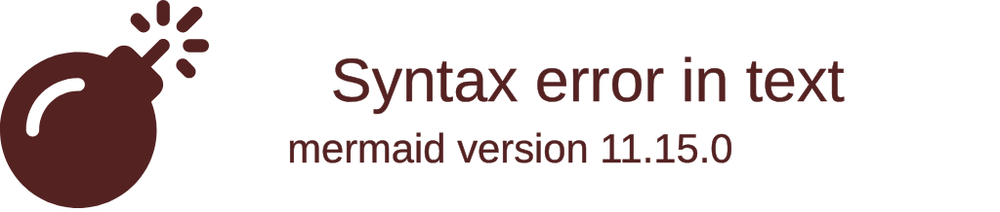

<%*
// Weekly Review Template
// For summarizing weekly progress against project milestones
const weekNum = await tp.system.prompt("Week number:", tp.date.now("W"));
const weekStart = tp.date.now("YYYY-MM-DD", -tp.date.now("d"));
const weekEnd = tp.date.now("YYYY-MM-DD", 6-tp.date.now("d"));

// Calculate project progress
const projectStart = moment("2026-01-26");
const projectEnd = moment("2026-04-10");
const totalWeeks = projectEnd.diff(projectStart, 'weeks');
const weeksElapsed = moment().diff(projectStart, 'weeks');
_%>
---
week: <% weekNum %>
week_start: <% weekStart %>
week_end: <% weekEnd %>
type: weekly-review
project: Tracking Control NN Defense
tags: [weekly, review, progress]
---

# 📊 Week <% weekNum %> Review

> **Period:** <% moment(weekStart).format("MMM D") %> - <% moment(weekEnd).format("MMM D, YYYY") %>

---

## 🎯 Weekly Goals (Set at Start)

### Primary Goals
- [ ] 
- [ ] 
- [ ] 

### Secondary Goals
- [ ] 
- [ ] 

---

## ✅ Accomplishments

### Major Achievements
1. 
2. 
3. 

### Minor Progress
- 

### Unexpected Wins
- 

---

## 📈 Progress by Category

### 📚 Learning & Understanding
| Topic | Status | Notes |
|-------|--------|-------|
| | 🔴🟡🟢 | |

### 💻 Implementation
| Component | Language | Status | Notes |
|-----------|----------|--------|-------|
| | | | |

### ✍️ Writing & Documentation
| Document | Progress | Notes |
|----------|----------|-------|
| | % | |

### 🤝 Collaboration
- Professor meetings: 
- Other: 

---

## 📊 Metrics

### Time Breakdown


### Quantitative Progress
| Metric | This Week | Total |
|--------|-----------|-------|
| Papers read | | |
| Concepts mastered | | |
| Lines of code | | |
| Hours worked | | |

---

## 📅 Milestone Tracking

### Current Milestone
**Name:** 
**Due Date:** 
**Progress:** ___% complete

### Upcoming Deadlines
| Deadline | Task | Days Left |
|----------|------|-----------|
| | | |

---

## ❌ What Didn't Get Done
*And why:*

1. **Task:** 
   - **Reason:** 
   - **Carry forward?** Yes/No

---

## 🧠 Key Learnings This Week

### Technical Insights
1. 
2. 

### Process Improvements
1. 

### From Professor Feedback
1. 

---

## ❓ Open Questions

### Technical
1. 

### Strategic
1. 

---

## 🚧 Blockers & Challenges

### Current Blockers
- **Blocker:** 
  - **Impact:** 
  - **Plan to resolve:** 

### Challenges Overcome
- 

---

## 📝 Notes from Daily Logs

```dataview
TABLE focus as "Focus", time as "Time Spent"
FROM #daily
WHERE date >= date("<% weekStart %>") AND date <= date("<% weekEnd %>")
SORT date ASC
```

---

## 🎯 Next Week's Plan

### Primary Goals
1. 
2. 
3. 

### Tasks
- [ ] Monday: 
- [ ] Tuesday: 
- [ ] Wednesday: 
- [ ] Thursday: 
- [ ] Friday: 
- [ ] Weekend: 

### Professor Meeting Prep
- Questions to ask:
  1. 
- Materials to prepare:
  1. 

---

## 💭 Reflections

### What Worked Well
- 

### What Could Improve
- 

### Adjustments for Next Week
- 

---

## 📊 Weekly Rating
- Productivity: ⭐⭐⭐⭐⭐ ( /5)
- Learning: ⭐⭐⭐⭐⭐ ( /5)
- Satisfaction: ⭐⭐⭐⭐⭐ ( /5)

---

## 🔗 Related Notes
### Daily Logs This Week
- [[<% weekStart %> Daily Log]]

### Key Notes Created
- [[]]
